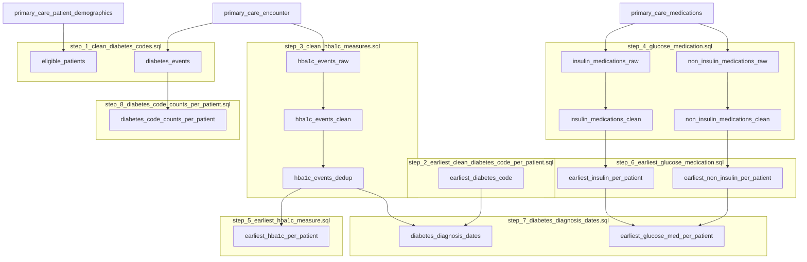

# Phenotype Data Flow

The diagram below illustrates table dependencies and processing
steps used to construct the phenotype cohort.

Any change to SQL logic should be reflected here.

## Data

* [1 Clean diabetes codes](step_1_clean_diabetes_codes.sql)
* [2 Earliest clean diabetes code per patient](step_2_earliest_clean_diabetes_code_per_patient.sql)
* [3 Clean HbA1c measurements](step_3_clean_hba1c_measures.sql)
* [4 Glucose-lowering medication](step_4_glucose_medication.sql)
* [5 Earliest high HbA1c measurements](step_5_earliest_hba1c_measure.sql)
* [6 Earliest glucose-lowering medication](step_6_earliest_glucose_medication.sql)
* [7 Diabetes diagnosis dates](step_7_diabetes_diagnosis_dates.sql)
* [8 Diabetes counts per patient](step_8_diabetes_code_counts_per_patient.sql)
